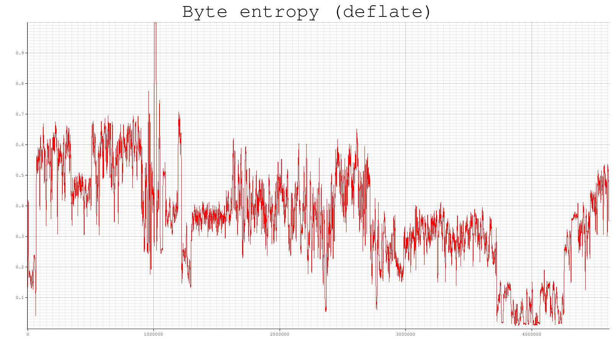

# entrs

Deflate based approximate entropy plot of binary files.

```
Usage: entrs -f FILE [OPTIONS]

Options:
    -f, --file FILE     Input data
    -o, --output FILE   Plot output
    -w, --window-size SIZE
                        Compression window size
    -s, --step-by SIZE  Window setp size
    -h, --help          print this help menu
```
Compress segments of the files and plot the relative compression. The final compression size approximates the entropy of the segment.

The compression is done on windows of size `w` (default 4096) stepping by `s` (default 64) bytes at a time.
Increasing the window size will analyze larger segments (using smaller segments is better for locality, but too small segments won't allow deflate to work at its best), increasing the step size will result in fewer data points, but faster computation and viceversa.

### Example
`entrs -f ./entrs`
